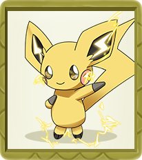

# NFT角色

玩家可通过购买精灵球随机获得小精灵，目前共有15种创世小精灵，已涵盖了15类蛋群。未来随着游戏更新会繁殖出新品种的小精灵。

#### 凤王

它具有复活逝者的神奇力量。在它飞过的地方会形成彩虹。传说看到它的人会获得永远的幸福。在钟之塔（即烧焦塔前身）被烧毁前，它在铃铃塔顶栖息。据推测，它在其后一直飞翔于天空，寻找内心纯洁的人。



| 类型   | 值       |
| ---- | ------- |
| 属性   | 火/飞     |
| 稀有程度 | 传说      |
| 身高   | 3.8m    |
| 体重   | 199.0kg |
| 进化   | 不进化     |



| 类型 | 值   |
| -- | --- |
| HP | 106 |
| 攻击 | 130 |
| 防御 | 90  |
| 特攻 | 110 |
| 特防 | 154 |
| 速度 | 110 |



| 类型   | 值   |
| ---- | --- |
| 蛋群   | 阿尔法 |
| 雌雄比例 | 无性别 |



#### 百变怪

它浑身都是稍淡的紫色。它拥有一双小小的黑眼睛，身体软而富有弹性。睡觉的时候变成石头防止被袭击。两只同时相遇，为了能变成和对方一模一样的样子而比平常更剧烈地动作。它可以通过改变自身的细胞组合并复制一切被复制对象的细胞组合而幻化为对方的样子，甚至可以使用对手的技能。



| 类型   | 值     |
| ---- | ----- |
| 属性   | 一般    |
| 稀有程度 | 神话    |
| 身高   | 0.3m  |
| 体重   | 4.0kg |
| 进化   | 不进化   |



| 类型 | 值  |
| -- | -- |
| HP | 48 |
| 攻击 | 48 |
| 防御 | 48 |
| 特攻 | 48 |
| 特防 | 48 |
| 速度 | 48 |



| 类型   | 值   |
| ---- | --- |
| 蛋群   | 百变怪 |
| 雌雄比例 | 无性别 |



#### 凯西

它可以通过心灵感应雷达感知危险。 当它这样做时，它会传送到一个安全的位置。 然而，如果它在一个未知的位置醒来，它有时会变得恐慌。 通过对自己进行催眠，它甚至可以在睡觉时传送自己。 它也可以在睡觉时使用其他超感官能力，甚至可以传送到树梢上采摘和吃浆果。 睡得越深，传送得越远。 然而，由于其心灵感应能力的紧张，它每天睡 18 个小时。 如果它不能休息足够长的时间，它将无法使用它的力量。 它的梦境中的内容会影响它的力量。



| 类型   | 值         |
| ---- | --------- |
| 属性   | 超能力       |
| 稀有程度 | 神话        |
| 身高   | 0.9m      |
| 体重   | 19.5kg    |
| 进化   | 凯西→勇基拉→胡地 |



| 类型 | 值   |
| -- | --- |
| HP | 25  |
| 攻击 | 20  |
| 防御 | 15  |
| 特攻 | 105 |
| 特防 | 55  |
| 速度 | 90  |



| 类型   | 值         |
| ---- | --------- |
| 蛋群   | 人型        |
| 雌雄比例 | 雌:雄 = 1:1 |



#### 鬼斯

它能够通过用有毒气体将其包围起来在两秒钟内使一头印度象倒下。 在有些偶然情况下，它会得到像人一样说话的能力并能够转变它自己的形态。它可以用心电感应来交流，还能够制造幻影、变身为少女或老婆婆，以及与死亡者的灵魂沟通。



| 类型   | 值         |
| ---- | --------- |
| 属性   | 幽灵/毒      |
| 稀有程度 | 史诗        |
| 身高   | 1.3m      |
| 体重   | 0.1kg     |
| 进化   | 鬼斯→鬼斯通→耿鬼 |



| 类型 | 值   |
| -- | --- |
| HP | 30  |
| 攻击 | 35  |
| 防御 | 30  |
| 特攻 | 100 |
| 特防 | 35  |
| 速度 | 80  |



| 类型   | 值         |
| ---- | --------- |
| 蛋群   | 不定形       |
| 雌雄比例 | 雌:雄 = 1:1 |



#### 幼基拉斯

它出生在地下深处，远离它的父母。它通过消耗土壤来生长，并在吃掉整座山的土壤后进入蛹期。幼虫通常生活在山区、丘陵和洞穴中。



| 类型   | 值              |
| ---- | -------------- |
| 属性   | 岩石/地面          |
| 稀有程度 | 史诗             |
| 身高   | 0.6m           |
| 体重   | 72.0kg         |
| 进化   | 幼基拉斯→沙基拉斯→班基拉斯 |



| 类型 | 值  |
| -- | -- |
| HP | 50 |
| 攻击 | 64 |
| 防御 | 50 |
| 特攻 | 45 |
| 特防 | 50 |
| 速度 | 41 |



| 类型   | 值         |
| ---- | --------- |
| 蛋群   | 怪兽        |
| 雌雄比例 | 雌:雄 = 1:1 |



#### 卡拉卡拉

它一直戴着已经去世的母亲的头盖骨，所以不清楚其真实面貌是怎样的。悲伤和寂寞时戴着的头盖骨会摆动发出短暂悲伤的声音。据说它与袋龙有关系，疑似是袋龙的宝宝。



| 类型   | 值         |
| ---- | --------- |
| 属性   | 地面        |
| 稀有程度 | 史诗        |
| 身高   | 0.4m      |
| 体重   | 6.5kg     |
| 进化   | 卡拉卡拉→嘎啦嘎啦 |



| 类型 | 值  |
| -- | -- |
| HP | 50 |
| 攻击 | 50 |
| 防御 | 95 |
| 特攻 | 40 |
| 特防 | 50 |
| 速度 | 35 |



| 类型   | 值         |
| ---- | --------- |
| 蛋群   | 怪兽        |
| 雌雄比例 | 雌:雄 = 1:1 |



#### 妙蛙种子

它最显著的特点就是它背后那个鳞茎状的种子，种子与蛙之间存在着共生关系，从它出生起就种子和身体一同生长了。



| 类型   | 值            |
| ---- | ------------ |
| 属性   | 草/毒          |
| 稀有程度 | 稀有           |
| 身高   | 0.7m         |
| 体重   | 6.9kg        |
| 进化   | 妙蛙种子→妙蛙草→妙蛙花 |



| 类型 | 值  |
| -- | -- |
| HP | 45 |
| 攻击 | 49 |
| 防御 | 49 |
| 特攻 | 65 |
| 特防 | 65 |
| 速度 | 45 |



| 类型   | 值         |
| ---- | --------- |
| 蛋群   | 怪兽/植物     |
| 雌雄比例 | 雌:雄 = 1:1 |



#### 杰尼龟

它是天生的游泳健将，但由于体型太小，它只适合运送一些小型的物品。虽然它的下巴看起来很不起眼，但它可以学习咬咬。它的头很小，但可以使用火箭头槌。



| 类型   | 值           |
| ---- | ----------- |
| 属性   | 水           |
| 稀有程度 | 稀有          |
| 身高   | 0.5m        |
| 体重   | 9.0kg       |
| 进化   | 杰尼龟→卡咪龟→水箭龟 |



| 类型 | 值  |
| -- | -- |
| HP | 44 |
| 攻击 | 48 |
| 防御 | 65 |
| 特攻 | 50 |
| 特防 | 64 |
| 速度 | 43 |



| 类型   | 值         |
| ---- | --------- |
| 蛋群   | 怪兽/水中1    |
| 雌雄比例 | 雌:雄 = 1:1 |



#### 小火龙

它尾巴上的火焰能够表现出它的情绪。当它开心时，火焰会摇曳。如果它被激怒，火焰就会猛烈地燃烧。生下来的时候，尾巴上就有火在燃烧。当尾巴上的火熄灭时，它的生命就结束了。



| 类型   | 值           |
| ---- | ----------- |
| 属性   | 火           |
| 稀有程度 | 稀有          |
| 身高   | 0.6m        |
| 体重   | 8.5kg       |
| 进化   | 小火龙→火恐龙→喷火龙 |



| 类型 | 值  |
| -- | -- |
| HP | 39 |
| 攻击 | 52 |
| 防御 | 43 |
| 特攻 | 60 |
| 特防 | 50 |
| 速度 | 65 |



| 类型   | 值         |
| ---- | --------- |
| 蛋群   | 怪兽/龙      |
| 雌雄比例 | 雌:雄 = 1:1 |



#### 皮丘

通常成群结队，经常与其他比丘碰尾巴以示勇气，产生的火花可以让他们哭泣。它不擅长储存电力，如果被逗乐、受到惊吓或受到电击可能会放电。然而，它不能在不受到电击的情况下放电。在干燥的日子或有雷雨天气时，充电更容易。可以听到皮丘产生的静电噼啪声。它可以电击一个成年人，但如果它这样做了，它也会让自己大吃一惊。



| 类型   | 值         |
| ---- | --------- |
| 属性   | 电         |
| 稀有程度 | 稀有        |
| 身高   | 0.3m      |
| 体重   | 2.0kg     |
| 进化   | 皮丘→皮卡丘→雷丘 |



| 类型 | 值  |
| -- | -- |
| HP | 20 |
| 攻击 | 40 |
| 防御 | 15 |
| 特攻 | 35 |
| 特防 | 35 |
| 速度 | 60 |



| 类型   | 值         |
| ---- | --------- |
| 蛋群   | 陆上/妖精     |
| 雌雄比例 | 雌:雄 = 1:1 |



#### 蚊香蝌蚪

它有一条细长的尾巴，周围环绕着淡蓝色、半透明的鳍。它的尾巴使它成为一个强大的游泳者。尽管有危险，它喜欢在陆地上蹒跚而行。然而，如果它看到危险，它会很快回到水中。除非每天训练，否则它不能很好地在陆地上行走。



| 类型   | 值             |
| ---- | ------------- |
| 属性   | 水             |
| 稀有程度 | 普通            |
| 身高   | 0.6m          |
| 体重   | 12.4kg        |
| 进化   | 蚊香蝌蚪→蚊香君→蚊香泳士 |



| 类型 | 值  |
| -- | -- |
| HP | 40 |
| 攻击 | 50 |
| 防御 | 40 |
| 特攻 | 40 |
| 特防 | 40 |
| 速度 | 90 |




| 类型   | 值         |
| ---- | --------- |
| 蛋群   | 水中1       |
| 雌雄比例 | 雌:雄 = 1:1 |



#### 角金鱼

独角的攻击很强烈。非常喜欢在河流或池塘中游动。但被放入水箱的话，就算是厚厚的玻璃也要用角撞破逃走。



| 类型   | 值       |
| ---- | ------- |
| 属性   | 水       |
| 稀有程度 | 普通      |
| 身高   | 0.6m    |
| 体重   | 15.0kg  |
| 进化   | 角金鱼→金鱼王 |



| 类型 | 值  |
| -- | -- |
| HP | 45 |
| 攻击 | 67 |
| 防御 | 60 |
| 特攻 | 35 |
| 特防 | 50 |
| 速度 | 63 |



| 类型   | 值         |
| ---- | --------- |
| 蛋群   | 水中2       |
| 雌雄比例 | 雌:雄 = 1:1 |



#### 大舌贝 

​

硬壳能弹开任何攻击，打开壳的时候里面被攻击的话会很脆弱。到了夜里用大大的舌头在海底的沙子上挖洞睡在里面。虽然闭合贝壳睡觉，但舌头就那么伸在外面。



| 类型   | 值       |
| ---- | ------- |
| 属性   | 水       |
| 稀有程度 | 普通      |
| 身高   | 0.3m    |
| 体重   | 4.0kg   |
| 进化   | 大舌贝→刺甲贝 |



| 类型 | 值   |
| -- | --- |
| HP | 30  |
| 攻击 | 65  |
| 防御 | 100 |
| 特攻 | 45  |
| 特防 | 25  |
| 速度 | 40  |



| 类型   | 值         |
| ---- | --------- |
| 蛋群   | 水中3       |
| 雌雄比例 | 雌:雄 = 1:1 |



#### 超音蝠 

在太阳落山后才开始活动。因为它的皮肤薄到只要被阳光照射到就会晒伤，所以白天会躲在阴暗处睡觉。天气变冷后，它们就会抱团取暖。



| 类型   | 值                         |
| ---- | ------------------------- |
| 属性   | 毒/飞行                      |
| 稀有程度 | 普通                        |
| 身高   | 0.8m                      |
| 体重   | 7.5kg                     |
| 进化   | 超音蝠→大嘴蝠→叉字蝠小磁怪→三合一磁怪→自爆磁怪 |



| 类型 | 值  |
| -- | -- |
| HP | 40 |
| 攻击 | 45 |
| 防御 | 35 |
| 特攻 | 30 |
| 特防 | 40 |
| 速度 | 55 |



| 类型   | 值         |
| ---- | --------- |
| 蛋群   | 飞行        |
| 雌雄比例 | 雌:雄 = 1:1 |



#### 小磁怪 

左右两边的部件释放出的电磁波屏蔽重力，从而悬浮在空中。左右两边的部件是强力的磁铁。能发出足以将半径100米以内的铁都吸引过来的强大磁力。



| 类型   | 值              |
| ---- | -------------- |
| 属性   | 电/钢            |
| 稀有程度 | 普通             |
| 身高   | 0.3m           |
| 体重   | 6.0kg          |
| 进化   | 小磁怪→三合一磁怪→自爆磁怪 |



| 类型 | 值  |
| -- | -- |
| HP | 25 |
| 攻击 | 35 |
| 防御 | 70 |
| 特攻 | 95 |
| 特防 | 55 |
| 速度 | 45 |



| 类型   | 值         |
| ---- | --------- |
| 蛋群   | 矿物        |
| 雌雄比例 | 雌:雄 = 1:1 |


